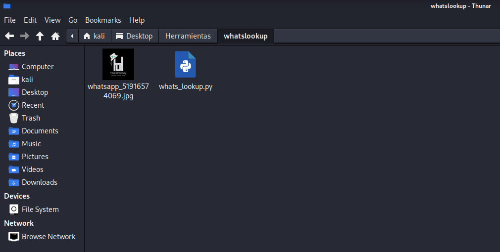

<h1 align="center">WHATS LOOKUP 🕵️‍♂️</h1>

<p align="center">
  <strong>OSINT tool for WhatsApp</strong> that allows you to obtain profile photos, verify Business accounts, check status and user information, analyze linked devices, review privacy settings, and access full data using the <strong>WhatsApp OSINT</strong> API from RapidAPI.
  <br>
  Supports 6 endpoints: <em>about, base64, business, devices, doublecheck, privacy</em>.
</p>

<p align="center">
  
</p>

<p align="center">
  
  
  
</p>

---

## 🚀 Features

- Retrieve WhatsApp profile photos via phone number  
- Verify WhatsApp Business accounts  
- Check user status and basic info  
- Analyze linked devices  
- Full OSINT information retrieval  
- View privacy settings  
- Automatic validation of phone number formats  
- Supports international numbers (with country code)  
- Interactive terminal interface with colors and menus  
- Auto-save images in JPG format  
- Detect hidden or missing profile pictures  

---

## 📌 Requirements

- Python 3.8+  
- Libraries: `requests`, `python-dotenv`, `colorama`  

---

## 🔑 API Key (RapidAPI)

| NAME | KEY |
|------|-----|
| [Whatsapp OSINT](https://rapidapi.com/inutil-inutil-default/api/whatsapp-osint) | 🔑 (Required) |

- Choose a plan → [Basic](https://rapidapi.com/inutil-inutil-default/api/whatsapp-osint/pricing)  
- Copy your **API Key**  
- Rename the `.env.example` file to `.env`  
- Add your API Key inside the `.env` file  

---

### 🛠️ Step 1: Configure your API in the .env file

In your project root, run:

```bash
cp .env.example .env
````

🔹 This creates a new `.env` file with the same content as `.env.example`.
🔹 `.env.example` remains untouched (serves as a template).

---

### 🛠️ Step 2: Open the .env file for editing

Use nano (or any editor you prefer, such as vim or VS Code):

```bash
nano .env
```

---

### 🛠️ Step 3: Edit the variables

Inside nano you’ll see something like:

```
RAPIDAPI_KEY=your_api_key_here
```

👉 Replace it with your actual key, for example:

```
RAPIDAPI_KEY=yysnssksls536m3mdlldldmdddlld
```

---

### 🛠️ Step 4: Save the changes in nano

* Press **Ctrl + O** → “Write Out” (save)
* Confirm the filename `.env` → press **Enter**
* Exit editor with **Ctrl + X**

---

### 🛠️ Step 5: Verify it’s saved

```bash
cat .env
```

---

## ⚠️ Usage Warning

This tool is created **only** for:

* Legitimate cybersecurity investigations
* Authorized security audits
* Educational OSINT projects
* Analysis with explicit consent

🔴 **Do NOT use this tool for illegal activity, harassment, or without consent.**
🟢 **The author is not responsible for any misuse.**

---

## ⚙️ Installation

Clone the repository:

```bash
git clone https://github.com/HackUnderway/whatslookup.git
cd whatslookup
pip install -r requirements.txt
```

---

## 🐍 Basic Usage

Run the script:

```bash
python3 whats_lookup.py
```

* Choose an option from the menu (1–6)
* Enter the phone number including country code (e.g. 51987654321)
* The tool validates the number format and performs the lookup
* Results are displayed according to the selected query type

<p align="center">
  
</p>

> **The project is open for contributors.**

---

## 💻 Supported Distributions

| Distribution       | Verified Version | Supported? | Status  |
| ------------------ | ---------------- | ---------- | ------- |
| Kali Linux         | 2025.2           | ✅          | Working |
| Parrot Security OS | 6.3              | ✅          | Working |
| Windows            | 11               | ✅          | Working |
| BackBox            | 9                | ✅          | Working |
| Arch Linux         | 2024.12.01       | ✅          | Working |

---

## 💬 Support & Credit

Thanks & Credit to → **[HackUnderway](https://github.com/HackUnderway/whatslookup?tab=readme-ov-file)**

---
